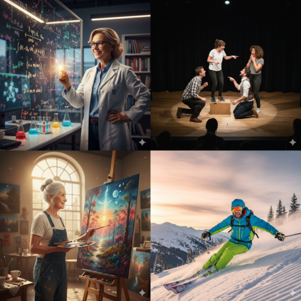

## Vorbereitung

Vorkenntnisse sind nicht erforderlich. Empfohlene Lektüre:

* A Review on the Role of the Neuroscience of Flow States in the Modern World.
  https://pmc.ncbi.nlm.nih.gov/articles/PMC7551835/ (Englisch)
* Buch "Finding Flow: The Psychology of Engagement With Everyday Life." von
  Mihály Csíkszentmihályi (Englisch)

## Was werden wir tun?

Was macht ein erfülltes Leben aus? Auf der Suche nach dem Verständnis, wie manche Menschen auch unter widrigen Umständen glücklich bleiben, führte der ungarisch-amerikanische Psychologe Mihály Csíkszentmihályi bahnbrechende Forschungen zu einer einzigartigen Art von erfüllenden, produktiven und optimalen Erfahrungen durch, die er „Flow-Zustand" nannte. Kulturen- und berufsübergreifend beobachtete er, dass „die Erfahrung selbst so angenehm ist, dass Menschen sie auch unter großen Kosten ausüben, allein um der Sache selbst willen." Populär bekannt als „in der Zone sein", zeichnet sich dieser Zustand durch ein tiefes Eintauchen in eine Aktivität aus, mit erhöhter Aufmerksamkeit, optimierter Leistung und intrinsischer Belohnung.

In einer 25-minütigen Einführung werden wir in das Konzept des Flow-Zustands, seine psychologischen und neurophysiologischen Korrelate und Tipps zur Förderung von Flow in unserem Leben eintauchen. Wir werden einige Übungen durchführen, um in einen Flow-Zustand zu gelangen. Wir werden diese und verwandte Themen in kleineren Gruppen diskutieren, um Ideen und persönliche Erfahrungen auszutauschen.

## Organisation

Mach dir keine Sorgen, wenn du denkst, dass du nichts beitragen kannst! Jeder ist willkommen!

Es gibt immer eine Mischung aus Deutsch- und Englischsprachigen, und wir gestalten die Diskussionsrunden so, dass sich jeder wohlfühlt. Die Hauptsprache ist Englisch.

Dieses Treffen wird von Ana moderiert.

Es wird Snacks und Getränke geben.

Nach dem Treffen werden wir zum Abendessen gehen. Jeder, der Zeit hat, ist herzlich eingeladen, sich anzuschließen.

<small>In der obigen Karte ist der Ort markiert, an dem du dein Fahrrad abstellen solltest (blau), und der Eingang (am Ende der Metallrampe) mit einem roten Kreuz.</small>

## Sonstiges

[Erfahre mehr über uns]().

<small>Bild generiert mit _Gemini_.</small>
