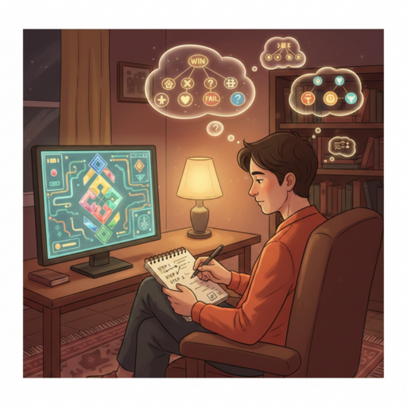

## Preparation

If possible, bring a **laptop** to the meetup. Don't worry if you can't,
since you'll spend most of the time thinking and discussing as opposed to
playing. We can take turns.

## What will we do?

Humans often solve complex problems via iteration and empiricism. Usually,
trying to figure everything out from first principles without experimenting is a
bad idea. You can spend loads of time thinking, and then you go outside and
interact with reality for 5 minutes and realize all that thinking was pointed in
the wrong direction.

But some important problems have poor feedback loops, such that
iteration/empiricism don't work very well. Experimentation might take a really
long time, the results might be noisy, or you might just really need to get
something right on the first try.

Often, when making a plan in a confusing domain, it's enough to just ask
yourself "how do I expect this plan to turn out?" to get you to notice ways the
plan is likely to fail. Then you can fix those things. This is often faster than
doing the entire plan, and watching it fail, and then doing it all over again.

In this exercise, we will use a puzzle video game to practice a combination of
rationality skills:

- **Planmaking** — formulating a complete plan before acting
- **Calibration** — assessing how confident you are in each step
- **Inner Sim / Surprise-o-meter** — noticing when something feels off
- **Patience** — resisting the urge to just start fiddling

These skills weave together into something similar to Murphyjitsu, but with a
somewhat different flavor.

### Format

1. You'll be given a puzzle video game level, which you haven't played before.
2. Instead of fiddling around, playing with the game the way you might normally
   do... you will just look at the screen, and make a complete plan for solving
   a given level, before you begin to move your character around.
3. Write down that plan as a series of steps.
4. Before you execute your plan, for each step in the plan, consider all the
   ways that you might be surprised when you execute that step.
5. Loop through all of your "possible surprises", and consider if any of them
   actually seem more likely than your mainline plan. Consider updating your
   plan. If there is a step that might go multiple ways, try making multiple
   guesses and plans.
6. Are you confident in your plan? If so, execute it.
7. Did the plan go the way you expected? Spend 10 minutes reflecting on what
   you learned, and what you could have done differently.

## Organization

You are worried you have nothing to contribute? No worries! Everyone is
welcome!

There always is a mix of German and English speakers and we configure the
discussion rounds so that everyone feels comfortable participating. The primary
language is English.

This meetup will be hosted by Omar.

There will be snacks and drinks.

We will go and get dinner after the meetup. Anyone who has time is welcome to
join.

<small>In the above map the location where you should leave your bikes is marked
in blue and the entrance (at the end of the metal ramp) with a red cross.</small>

## Other

[Learn more about us]().

<small>Image generated with _Gemini / Nano Banana_.</small>
