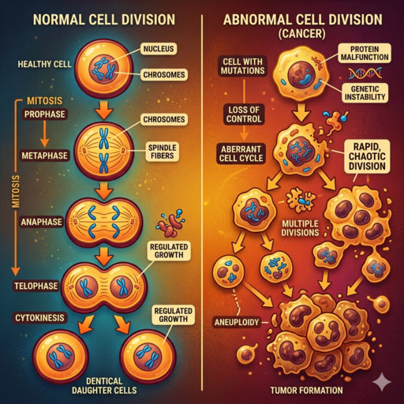

## Vorbereitung

Keine.

## Was werden wir tun?

Krebs ist nicht so einfach, wie es klingt, und verschiedene Arten verhalten sich
sehr unterschiedlich. Aber sie haben alle die gleichen Wurzeln: Etwas geht schief
bei der Art und Weise, wie Zellen wachsen und sich teilen, und die normalen
Abwehrmechanismen des Körpers schaffen es nicht, das zu erkennen.

Dieser Vortrag erklärt, wie das passiert, warum es oft Jahre dauert, bis sich
Krebs entwickelt, was die tatsächlichen Risikofaktoren sind und was moderne
Behandlungen wirklich bewirken.

## Organisation

Du machst dir Sorgen, dass du nichts beitragen kannst? Keine Sorge! Jede*r ist willkommen!

Es gibt immer eine Mischung aus deutsch- und englischsprachigen Teilnehmer*innen, und wir gestalten die Diskussionsrunden so, dass sich alle wohlfühlen. Die Hauptsprache ist Englisch.

Dieses Meetup wird von Catarina moderiert.

Es gibt Snacks und Getränke.

Nach dem Meetup gehen wir gemeinsam essen. Wer Zeit hat, ist herzlich eingeladen, mitzukommen.

<small>Auf der obigen Karte ist der Ort, an dem ihr eure Fahrräder abstellen könnt, blau markiert, und der Eingang (am Ende der Metallrampe) mit einem roten Kreuz.</small>

## Sonstiges

[Erfahre mehr über uns]().

<small>Bild generiert mit _Gemini_.</small>
