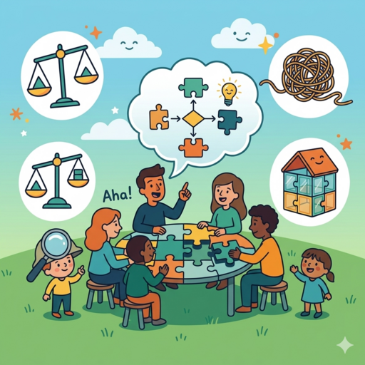

## Preparation

None.

## What will we do?

The goal of the meetup is making at least a small improvement in how we think.
We will practice this by reasoning from the ground up about simple physics
problems. I will provide problems with varying difficulty to accomodate people
with different backgrounds. The goal is not learning physics (even though this
might be a side-effect) but becoming better at finding general problem-solving
strategies.

You do not need a physics or math background to attend!

This is the third run of a popular event (see
[Thinking Physics]() and
[Thinking Physics 2]()).

## Organization

You are worried you have nothing to contribute? No worries! Everyone is
welcome!

There always is a mix of German and English speakers and we configure the
discussion rounds so that everyone feels comfortable participating. The primary
language is English.

This meetup will be hosted by Omar.

There will be snacks and drinks.

We will go and get dinner after the meetup. Anyone who has time is welcome to
join.

<small>In the above map the location where you should leave your bikes is marked
in blue and the entrance (at the end of the metal ramp) with a red cross.</small>

## Other

[Learn more about us]().

<small>Image generated with _Gemini_.</small>
