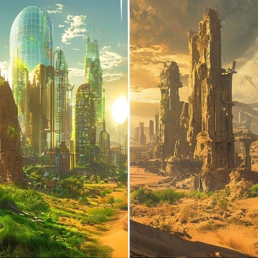

## Preparation

Before the session, take 5 minutes to write down your strongest arguments
**against** an AI threat. Not what you are worried about — what makes you think
it will probably be fine. Examples: "Doomsayers have always been wrong before.", "We have sufficient oversight over the algorythms"
"Current models are conceptually incapable of what people fear." You can do this
right before we start, but sooner is better as this allows you to think about it in more detail.

## What will we do?

This is a follow-up to our [Probability of Doom]() session from January 2025. A lot has happened
since then.

We will work through what the research actually says about AI risk — looking at
where different expert communities agree, where they disagree sharply, and why
that disagreement seems so hard to resolve.

The session has three update points: moments where you are invited to revise
your own probability estimates based on what you just heard or discussed.

Roughly we will go through the landscape of opinions, try to think through some scenarios and see what the data actually says.

At the end, there will be time for open discussion.

## Organization

You are worried you have nothing to contribute? No worries! Everyone is
welcome!

There always is a mix of German and English speakers and we configure the
discussion rounds so that everyone feels comfortable participating. The primary
language is English.

This meetup will be hosted by Ben.

There will be snacks and drinks.

We will go and get dinner after the meetup. Anyone who has time is welcome to
join.

<small>In the above map the location where you should leave your bikes is marked
in blue and the entrance (at the end of the metal ramp) with a red cross.</small>

## Other

[Learn more about us]().

<small>Image generated with Midjourney.</small>
