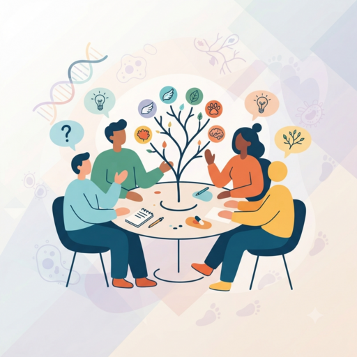

## Preparation

None.

## What will we do?

Evolution is one of the most widely misunderstood ideas in science, even
though most of us learned the basics in school. In this interactive meetup we
will clear up some of the most common misconceptions.

In small groups, you will first come up with a hypothesis for how a specific
trait or behavior could have evolved. Afterwards, Omar will present the
current scientific consensus and we will discuss how it compares to our
hypotheses.

No knowledge beyond high school biology is expected.

Note: Omar is not a subject matter expert, just someone fascinated by
evolution. Actual experts who can correct anything he gets wrong are very
welcome!

## Organization

You are worried you have nothing to contribute? No worries! Everyone is
welcome!

There always is a mix of German and English speakers and we configure the
discussion rounds so that everyone feels comfortable participating. The primary
language is English.

This meetup will be hosted by Omar.

There will be snacks and drinks.

We will go and get dinner after the meetup. Anyone who has time is welcome to
join.

<small>In the above map the location where you should leave your bikes is marked
in blue and the entrance (at the end of the metal ramp) with a red cross.</small>

## Other

[Learn more about us]().

<small>Image generated with _Gemini_.</small>
