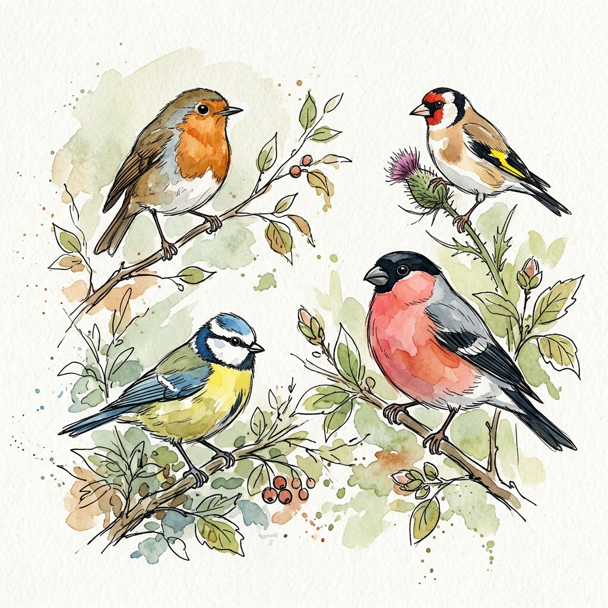

## Preparation

None.

## What will we do?

Birds catch our attention with their colorful appearance and striking songs.
Although they are so familiar to us, their way of life holds some surprises.

In this meetup we will hear about the amazing abilities of these animals and
learn about the diverse evolutionary adaptation strategies that have developed
in this group of animals.

## Organization

You are worried you have nothing to contribute? No worries! Everyone is
welcome!

There always is a mix of German and English speakers and we configure the
discussion rounds so that everyone feels comfortable participating. The primary
language is English.

This meetup will be hosted by Anna.

There will be snacks and drinks.

We will go and get dinner after the meetup. Anyone who has time is welcome to
join.

<small>In the above map the location where you should leave your bikes is marked
in blue and the entrance (at the end of the metal ramp) with a red cross.</small>

## Other

[Learn more about us]().

<small>Image generated with _Gemini_.</small>
