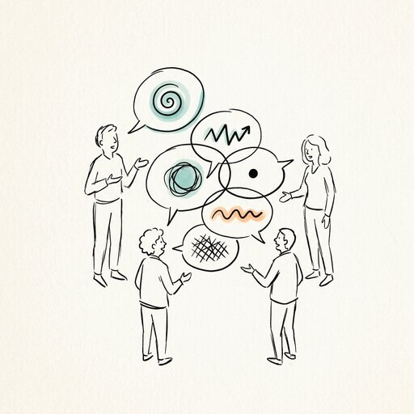

## Preparation

None.

## What will we do?

Have you ever had a conversation where you were convinced you were being
perfectly clear, yet the other person understood something completely
different?

In a community as diverse as ours, we constantly interact with people who may
have very different assumptions about communication, disagreement, trust,
hierarchy, feedback, and decision-making. Even when we share similar values and
a commitment to rational thinking, culture can quietly shape how we express
ideas and how we interpret others. In this workshop, we'll make some of these
invisible differences visible and explore what happens when we stop assuming
that our way of communicating is the default.

## Organization

You are worried you have nothing to contribute? No worries! Everyone is
welcome!

There always is a mix of German and English speakers and we configure the
discussion rounds so that everyone feels comfortable participating. The primary
language is English.

This meetup will be hosted by Joana.

There will be snacks and drinks.

We will go and get dinner after the meetup. Anyone who has time is welcome to
join.

<small>In the above map the location where you should leave your bikes is marked
in blue and the entrance (at the end of the metal ramp) with a red cross.</small>

## Other

[Learn more about us]().

<small>Image generated with _Gemini_.</small>
