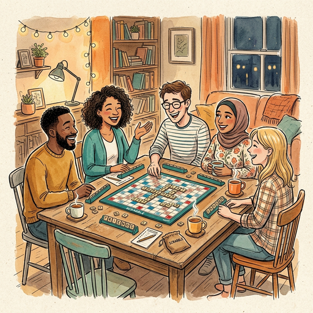

## Vorbereitung

Keine, aber es schadet nichts die [Regeln des Spiels](https://scrabble-info.de/wp-content/uploads/2016/03/Allgemeine-Scrabble-Spielregeln.pdf) zu lernen.
Falls ihr selbst ein Spiel habt, bringt es bitte mit.

## Was werden wir tun?

Wir werden uns kurz die einfachen Regeln des Spiels anschauen und dann untersuchen wie sich das
Denken über das Spiel zwischen Mensch und Computer unterscheidet.
Dabei werden wir sehen weshalb das Spiel für Computer vergleichsweise schwierig ist, weshalb
die Programme auch heute kaum besser sind, als die besten Menschen.

Am Ende ist etwas Übungszeit eingeplant, um das Spiel selbst erproben zu können.

## Organisation

Du machst dir Sorgen, dass du nichts beitragen kannst? Keine Sorge! Jede*r ist willkommen!

Es gibt immer eine Mischung aus deutsch- und englischsprachigen Teilnehmer*innen, und wir gestalten die Diskussionsrunden so, dass sich alle wohlfühlen. Die Hauptsprache ist Englisch.

Dieses Meetup wird von Omar moderiert.

Es gibt Snacks und Getränke.

Nach dem Meetup gehen wir gemeinsam essen. Wer Zeit hat, ist herzlich eingeladen mitzukommen.

<small>Auf der obigen Karte ist der Ort, an dem ihr eure Fahrräder abstellen könnt, blau markiert, und der Eingang (am Ende der Metallrampe) mit einem roten Kreuz.</small>

## Sonstiges

[Erfahre mehr über uns]().

<small>Bild generiert mit _Gemini_.</small>
