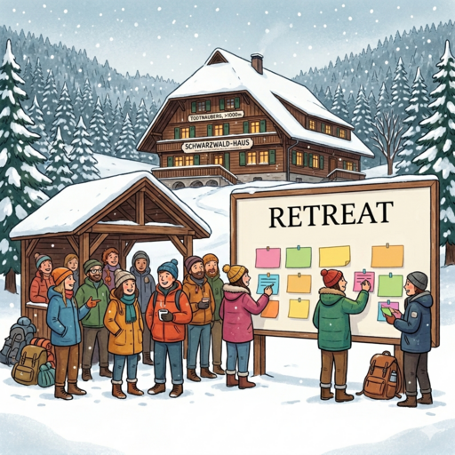

* **Registration** is required to participate! See details below.
* The number of participants is **limited**.
* Participants are **expected to agree** with the following
  self-characterizations:
  * "I'm open to changing my mind on some of my core beliefs."
  * "I'm happy to delay saying what I think if it can help being cooperative."

## Preparation

None. If you would like to run your own session, please get in touch with Omar via Signal or email to [omar@ratfr.de](mailto:omar@ratfr.de).

## What will we do?

We will spend the weekend with a series of workshops, talks and social activities surrounded by the beautiful landscape of the Black Forest. The content will be participant driven in an unconference style. On Friday afternoon we put up daily planners and by Saturday morning the attendees fill them up with session ideas. Some sessions are prepared upfront, but when inspiration hits some are just made up on the spot.

## Organization

The venue is a charming old Black Forest mansion in Todtnauberg, over 1000 meters above sea level. It has 23 beds in total (2-5 per room), a large common room and smaller TV room to use for the workshops. For more information about the venue, check the [Scheuermatthof website](https://ferienhaus-schwarzwald-todtnauberg.de/).

We will prepare our own meals. If you are interested to help, please get in touch with Catarina via Signal or email to [catarina@ratfr.de](mailto:catarina@ratfr.de).

We will start Friday late afternoon with flexible arrival from 18:00. On Sunday, we will continue with sessions until lunch time and then start cleaning up. We have to return the keys by 18:00.

## Do I need to bring anything?

Please bring your own bed linen (fitted sheet, duvet cover, and pillowcase) and towels. Alternatively, you can book complete bed linen (12€ per person: fitted sheet, duvet cover, and pillowcase) and towels (one big, one small: 4€ per person). Apart from this, just curiosity and good mood is needed!

## Registration

* **Costs** are estimated at **225€ per person** including 2 nights of accommodation and all meals, drinks and snacks. This includes a **35€ refundable deposit** which will be refunded provided there is no damage.
* The price varies depending on which room you sleep in:

  | Room type | Adjustment | Estimated total |
  |---|---|---|
  | 5-person room | −48€ | ~177€ |
  | 4-person room | −30€ | ~195€ |
  | 2-person room (no private bathroom) | +30€ | ~255€ |
  | 2-person room (private bathroom) | +70€ or +80€ | ~295€ or ~305€ |

* A final calculation will be made after the event, as some costs (electricity, food) are variable. The estimates above are based on last year's expenses.
* To secure your spot, please email [omar@ratfr.de](mailto:omar@ratfr.de) and pay **70€ immediately**. The remaining amount is due by **August 31st**.
* Cancellation policy: Cancellation is free of charge as long as a suitable replacement can be found — in which case you will receive a full refund. Last year this was not an issue as there were more applications than spots available.

## Other

[Learn more about us]().

<small>Image generated with _Gemini_.</small>
