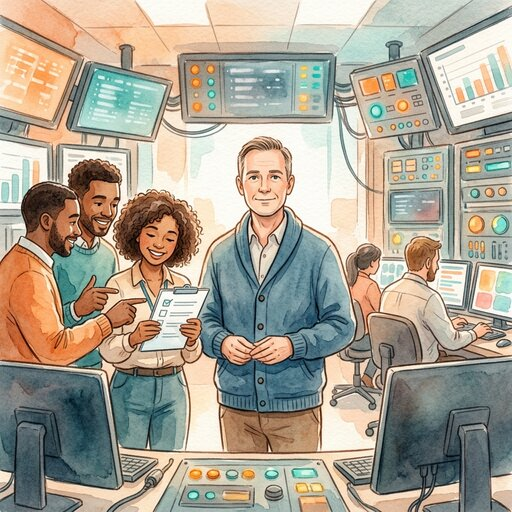

## Vorbereitung

Keine.

## Was werden wir tun?

In der Theorie wissen wir alle, wie gute Entscheidungen funktionieren: Evidenz
sammeln, Annahmen rational aktualisieren, Optionen abwägen und gezielt handeln.
Doch unter Zeitdruck, unvollständigen Informationen und akuter Überlastung
bricht dieses Modell in der Praxis oft zusammen. Stattdessen dominieren
Tunnelblick, lähmende Hierarchiebarrieren und scheinbar koordiniertes Chaos.

In diesem Meetup zeige ich euch, wie Entscheidungsfindung und Kommunikation in
Hochrisikoumgebungen funktionieren. Wir beleuchten typische kognitive
Verzerrungen unter akutem Stress und erarbeiten gemeinsam, welche Werkzeuge und
Strategien aus dem Krisenmanagement sich konkret nutzen lassen, um auch im
eigenen (Arbeits-)Alltag unter Druck handlungsfähig zu bleiben.

## Organisation

Du machst dir Sorgen, dass du nichts beitragen kannst? Keine Sorge! Jede*r ist willkommen!

Es gibt immer eine Mischung aus deutsch- und englischsprachigen Teilnehmer*innen, und wir gestalten die Diskussionsrunden so, dass sich alle wohlfühlen. Die Hauptsprache ist Englisch.

Dieses Meetup wird von Bettina moderiert.

Es gibt Snacks und Getränke.

Nach dem Meetup gehen wir gemeinsam essen. Wer Zeit hat, ist herzlich eingeladen mitzukommen.

<small>Auf der obigen Karte ist der Ort, an dem ihr eure Fahrräder abstellen könnt, blau markiert, und der Eingang (am Ende der Metallrampe) mit einem roten Kreuz.</small>

## Sonstiges

[Erfahre mehr über uns]().

<small>Bild generiert mit _Gemini_.</small>
