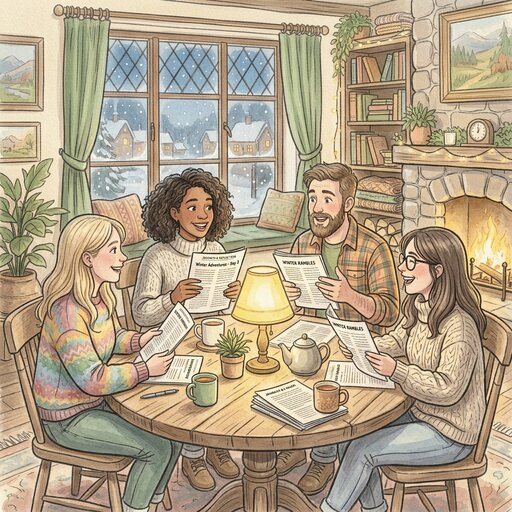

**Background:** [ACX (Astral Codex Ten)](https://www.astralcodexten.com) is a blog
by Scott Alexander that is popular in the rationality community. Please join
even if you are not (yet) a fan!

## Preparation

Read at least one of the following topics, preferably two:

* [Against "Stochastic Terrorism"](https://www.astralcodexten.com/p/against-stochastic-terrorism)
* [The Hugging Face Incident](https://www.astralcodexten.com/p/the-hugging-face-incident)
  * optional: [Highlights From The Discourse On The Hugging Face Incident](https://www.astralcodexten.com/p/highlights-from-the-discourse-on)
* [Psychology Research Is Mostly Fine](https://www.astralcodexten.com/p/psychology-research-is-mostly-fine)
  * optional: [The Beauty Of Settled Science](https://www.astralcodexten.com/p/the-beauty-of-settled-science)
* [Why I'm Staying Out Of The Substack Religion Debate](https://www.astralcodexten.com/p/why-im-staying-out-of-the-substack)

There is an [official podcast](https://sscpodcast.libsyn.com/) where someone
reads the blog posts aloud — available on Spotify, Apple Podcasts, and other
platforms.

Bring written answers to the following questions:

* This I already **knew**
* This I did **not understand**
* This I would like to **discuss**
* These are **my ideas** on the topic

People who did not have time to prepare will read "Against 'Stochastic
Terrorism'" during the meetup and only then join a discussion group.

## What will we do?

We will split into discussion groups depending on which article(s) you read and
then discuss the answers the participants brought.

## Organization

You are worried you have nothing to contribute? No worries! Everyone is
welcome!

There always is a mix of German and English speakers and we configure the
discussion rounds so that everyone feels comfortable participating. The primary
language is English.

This meetup will be hosted by Omar.

There will be snacks and drinks.

We will go and get dinner after the meetup. Anyone who has time is welcome to
join.

<small>In the above map the location where you should leave your bikes is marked
in blue and the entrance (at the end of the metal ramp) with a red cross.</small>

## Other

[Learn more about us]().

<small>Image generated with _Gemini_.</small>
