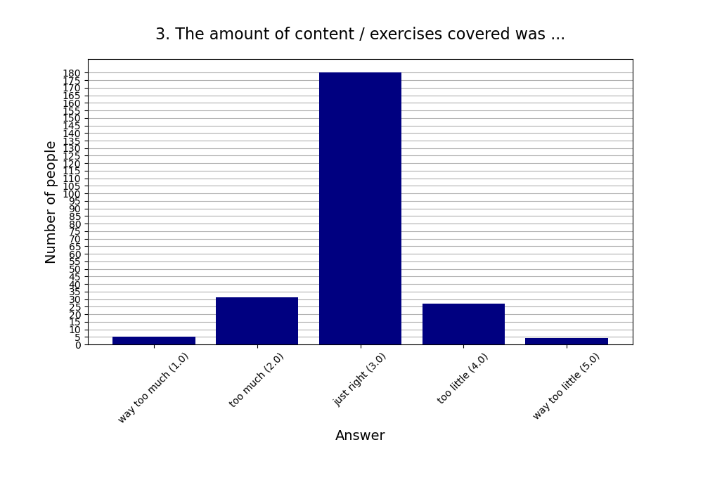

**Note that this page will be updated through 2024.**

This page contains a summary of all events. You can see the statistics
for the individual events here:

* [Double Crux]()
* [Cults & Cultishness]()
* [Boardgames]()
* [Achieving Goals]()
* [The Hard Problem of Consciousness]()
* [Thinking Physics (Closed Meetup)]()
* [ACX Spring Meetups Everywhere 2024]()
* [Hike]()
* [The Hard Problem of Consciousness Reloaded (Closed Meetup)]()
* [Lightning Discussions]()
* [Yoda Timers (Closed Meetup)]()
* [Street Epistemology]()
* [Introduction to Finances & ETFs (Closed Meetup)]()
* [Rationality Taboo]()
* [Street Epistemology 2 (Closed Meetup)]()
* [Thinking Physics 2]()
* [ACX Meetup Fall 2024]()
* [Secret Hitler & Other Games]()
* [State of Generative AI]()
* [Diplomacy]()

## Attendees

* 20 events.
* 14.35 people per event on average (σ=5.12).
* 2.15 newcomers per event (σ=3.10).
* Maximum number of attendees was 26 and minimum was 6 people.

**Recurring** is any person coming for the second, third etc. time whereas
**New** is anyone coming for the first time to a Rationality Freiburg event.

## Feedback

* **Responses:** 235 people (81.88% of attendees)

### 1. Practical use: For my life, what we did today will have ...

* **Responses:** 232 people (80.84% of attendees)
* **Answers:**
  * a lot of practical use (1): 41 people
  * quite a bit of practical use (2): 75 people
  * some practical use (3): 42 people
  * little practical use (4): 45 people
  * very little practical use (5): 29 people
* **Average answer:** 2.77 (σ=1.30)

### 2. The atmosphere / vibe was ...

* **Responses:** 234 people (81.53% of attendees)
* **Answers:**
  * fantastic (1): 108 people
  * good (2): 113 people
  * okay (3): 10 people
  * bad (4): 2 people
  * horrible (5): 1 person
* **Average answer:** 1.61 (σ=0.65)

### 3. The amount of content / exercises covered was ...

* **Responses:** 227 people (79.09% of attendees)
* **Answers:**
  * way too much (1): 5 people
  * too much (2): 31 people
  * just right (3): 164 people
  * too little (4): 23 people
  * way too little (5): 4 people
* **Average answer:** 2.96 (σ=0.63)

### 4. The difficulty level of the content / discussion was ...

* **Responses:** 230 people (80.14% of attendees)
* **Answers:**
  * much too easy (1): 6 people
  * too easy (2): 37 people
  * just right (3): 157 people
  * too difficult (4): 29 people
  * much too difficult (5): 1 person
* **Average answer:** 2.92 (σ=0.64)

### 5. Structure: On the whole the event needed ...

* **Responses:** 232 people (80.84% of attendees)
* **Answers:**
  * much more structure (1): 5 people
  * more structure (2): 33 people
  * (was just right) (3): 189 people
  * less structure (4): 5 people
  * much less structure (5): 0 people
* **Average answer:** 2.84 (σ=0.47)

### 6. The moderation should have been ...

* **Responses:** 230 people (80.14% of attendees)
* **Answers:**
  * much more relaxed (1): 6 people
  * more relaxed (2): 7 people
  * (was just right) (3): 192 people
  * more assertive (4): 21 people
  * much more assertive (5): 4 people
* **Average answer:** 3.04 (σ=0.54)

### 7. Host preparation: The content / exercises were ...

* **Responses:** 229 people (79.79% of attendees)
* **Answers:**
  * very well prepared (1): 88 people
  * well prepared (2): 83 people
  * okay prepared (3): 53 people
  * not well prepared (4): 3 people
  * not well prepared at all (5): 2 people
* **Average answer:** 1.90 (σ=0.86)

### 8. Changing your mind: The event made me ...

* **Responses:** 229 people (79.79% of attendees)
* **Answers:**
  * question many things (1): 10 people
  * question some things (2): 93 people
  * question few things (3): 66 people
  * question very few things (4): 42 people
  * not question anything (5): 18 people
* **Average answer:** 2.85 (σ=1.03)

### 9. Do you think you will come to one (or more) of the next three events?

* **Responses:** 233 people (81.18% of attendees)
* **Answers:**
  * probably no: 11 people
  * probably yes: 222 people

### 10. If you answered "probably no" in the previous question or are very uncertain, why is that?

* **Responses:** 12 people (4.18% of attendees)
* **Answers:**
  * Calendar too full.: 1 person
  * Do not get much enlightened due to diverse of discussions.: 1 person
  * Fitting it in the calendar is tricky atm.: 1 person
  * Friday evening is a bad timeslot for me.: 0 people
  * I can't fit another activity into my life.: 1 person
  * I did not like (some of) the people here.: 0 people
  * I did not like today's venue.: 0 people
  * I live too far away.: 8 people
  * I'm not very interested in your usual topics.: 0 people
  * The level of English is too advanced for me.: 0 people

### 11. What did you like the most today?

* **Responses:** 133 people (46.34% of attendees)

**Note:** Anything contained in square brackets [] is an edit by the organizers.

> I liked the „make the elephants like each other idea“

> Preconditions to ensure before using the method would be interesting to formalise. A list of common typical cruxes would be nice

> Friendly

> The discussion in the smaller group (though the group was still somewhat big)

> The exercise of fooling an outsider was great! [An older version of the feedback form had only one answer field for "best" and "worst". An organizer split that comment, making the best guess what the commenter was trying to say.]

> Small discussion group

> people

> The many views brought about by the different participants. The reading list.

> Die Übung

> the structure with 3 levels of preparation was very good idea

> Was fun

> die Stimmung + entspannte Atmosphäre

> - das Spielen hat sehr viel Spaß gemacht

> Was fun

> Viele neue Leute + Spiele kennengelernt

> Was fun to be introduced to new games.

> Cool games

> [The game] Karriere Poker

> Got to play Scrabble

> Mich mal wieder ein bisschen an die Karriere-Poker Strategie erinnern. War leider zu kurz, um komplett rein zu kommen.

> New room was great!

> Es gab eine sehr gute Balance zwischen Diskussion, Input und Übungen.  
> Die Triviafragen waren eine gute Idee, aber auch etwas stressig 😄

> Texts [An older version of the feedback form had only one answer field for "best" and "worst". An organizer split that comment, making the best guess what the commenter was trying to say.]

> New room is nice!

> Der große Raum war gut (wenn auch etwas kalt).

> discussions

> Der Raum war schön groß.

> I enjoyed the big group discussion about procrastination.

> Discussion was great. [An older version of the feedback form had only one answer field for "best" and "worst". An organizer split that comment, making the best guess what the commenter was trying to say.]

> Topic

> Room 10/10  
>   
> We have space for some movement exercises there maybe. Like arranging in order of attribute of person for introduction [Typo corrected]

> discussions + exercise

> topic

> Many interesting impulses.  
> Great atmosphere of discussions.

> the topic in general!

> Mind blown

> Some very interesting ideas popped up during presentation and discussion. [An older version of the feedback form had only one answer field for "best" and "worst". An organizer split that comment, making the best guess what the commenter was trying to say.]

> The topic, the progression.

> Gute Präsentationen, angenehme Stimmung.

> Open discussion. 

> Zivilisierte Diskussion in grosser Runde

> the small group discussion (was too little time though)

> Very interesting presentations focusing on two different aspects/approaches to the question of consciousness.

> The presentations and the discussions were really interesting and fun.

> Presentation is rich in content. [An older version of the feedback form had only one answer field for "best" and "worst". An organizer split that comment, making the best guess what the commenter was trying to say.]

> Digging really deep into seemingly simple problems with other people was very enjoyable.

> Loved the structuring and that the number of exercises was not too high.

> Super interesting content.  
> Discovered many flaws in my thinking.  
> Physics is cool!

> The discussions with other people who I hadn't met before. The mindbogliness of the questions.

> Very intersting topic. I liked to discover the flaws in my reasoning and thinking strategies. 

> Demonstrated my lack of intuitive, on-hand knowledge of physics and also that given enough time and effort, can understand (most of) it, even from just thinking and mulling over the problem

> Problems 

> Working in smaller groups depending on our level

> The book I got to know. :-)

> Diskussion

> Die Rätsel

> Noticing my own confusion

> Zu erkennen, dass eine gefühlte 80%ige Sicherheit leicht wieder kippen kann, wenn man länger nachdenkt.

> Most - topics

> Everyone had read some of the material so it was possible to have informed discussions.

> Snacks, some people 

> Zahlen bringen was, wenn man weiss, dass sie falsch sind

> Die Aussicht.

> vibes, the route, nature, discussions

> Most- everyone was inclusive and kind. Other things- hike location, organisation with the public transport

> Getting to know some people

> Fantastic weather, beautiful route and many interesting conversations.

> Good training impulse 😃  
> Group was relaxed, everyone seemed to enjoy the speed

> Walking together, talking to each other 

> Für mich haben Uhrzeit, Dauer und Niveau der Wanderung perfekt gepasst.

> Free seach

> Die Diskussionen.

> small group discussion  
> thought experiments  
> snacks

> Good structure, clear definitions and questions.

> The intro

> The sofa

> Talking about new things, ideas

> Gruppendiskussionen

> The variety of discussion topics

> Very diverse topics, enlightening discussion 

> Diskussionen im Allgemeinen und ihre Struktur (2 Minuten für These, 20 Minuten Gruppendiskussion)

> Escalator came before escalate

> Diskussion über Autokratien. 

> Condensing a topic to a short discussion worked well and made it very interesting.

> Ich durfte 2 minuten am Stück reden

> Örtlichkeit ist sehr schön, Menschen sind super nett und impulse waren cool

> Being actively involved (through the opportunity of bringing a topic)

> Small group discussion

> The atmosphere of a lot of people getting a lot of stuff done at the same time. :-)

> Small round, we all knew each other so it felt quite relaxing.

> Practical Exercise

> The chocolate was quite tasty.

> People ❤️

> How hard and yet possibly useful SE is. Also the video was good. The exercise with climate change belief was great as it was directionally aligned with my bias and so was hard and made me think.

> Interesting topic 

> The discussion 

> Practical part

> Learned a lot, good info and experiences on ETFs.

> Interesting topic with practical application. Useful to hear experiences from different people.

> Knowledge gain was noticeable.

> The interactive discussion all throughout

> SE kinda worked once [fixed grammar]

> Coole Methode!

> Interviews und vorbereitete Fragen

> Challenging questions.

> People

> Exchanging the strategies, interaktive Ansatz

> Systematic approach to thinking. Thanks so much!

> - Thinking logically  
> - Deconstruction of problems  
> - Focusing on the essential

> Das Nachdenken und diskutieren 

> Physics questions

> Speculatius

> Discussing & explaining

> People

> Invest in children

> The vibes. Feeling welcome and included despite me being shy.

> Vibe

> Secret hitler 

> Fun new games

> Was great fun!

> Visit by other rationality group member(s)

> Accusing Omar of being a fascist

> Was surprised by the advances

> Moderator Humor 

> Extraordinarily well structure and compact overview of currently available GenAI tools/plattforms/services that are worth trying. [Typo fixed]

> It was fun!

> Got a very good overview on AI tools. 

> Interactivity

> The story of Cicero

> The game

> combination of input, play and discussion,  vibe

> Playing Diplomacy 

> Playing together was quite fun
### 12. What did you like the least?

* **Responses:** 75 people (26.13% of attendees)

**Note:** Anything contained in square brackets [] is an edit by the organizers.

> Schade war, dass viel Zeit dafür verwendet wurde Dinge zu wiederholen, die man auch vorher hätte lesen können. Andererseits bereue ich das Lesen nicht, da dort viel mehr interessantes stand. Ich sehe auch, dass man nicht erwarten kann, dass alle vorbereitet zum Meeting kommen. Deshalb eine Idee, welche sich vielleicht praktisch umsetzen lässt: Beim Bilden von Untergruppen teilen wir die Leute auf zwischen denen, die zur Vorbereitung gelesen haben, und den anderen. So profitiert man zumindest dadurch von der eigenen Vorbereitung, dass man mit besser informierten Personen diskutieren kann. Ausnahme evtl. für Leute, die zum ersten Mal auftauchen.

> The conclusion to our discussion about cult. It could have been more structured. Maybe with a voting at the end from 1 to 5 how cultish this group is.

> nothing

> The content felt not cohesive. Some consolidation could help.

> Nichts

> - der Beginn hätte etwas lockerer / gesprächiger sein können

> too much game explanation time due to new players joining in between

> Didn't get to play any new game [Typo fixed]

> Insgesamt ist das Feedback-Formular eher unpassend für einen Spieleabend. ;)

> Exercise

> Die Diskussionen und übung hätten inhaltlich noch etwas spannendere Argumente bringen können, aber das ist halt nicht immer gleich.

> Exercise was quite hard.

> I was not prepared

> snacks :-D [This is an inside joke since some participants would like to snack less.]

> Many discussions in offtopic examples. Low abstraction level.

> less time

> A little bit chaotic today, longer discussion in small groups would have nice, clear definition of consciousness was not given

> First part didn't really 'introduced' what was then presented by Nawid. Felt a bit irrelevant for the discussion part.

> I think some parts of the presentations were not really relevant for the topic.

> Will wasn't fully clear about the arguments are the end. But might just need to think more about it.

> Mehr Zeit, um tiefer in die Diskussion zu gehen wäre gut

> Time management

> I would have preferred more time for discussions, maybe by splitting up the content into several Meetups.

> The discussion is not structured or guided.

> Maybe spend slightly more time on the solutions.

> Nothing. 

> Very Minor: didn't explicitly include "some ways to problem solve" except what came up during discussion. E.g. maybe one attempt without any such discussion and then one attempt after discussing such approaches. But then, would have had time crunch

> Problems

> The long discussion at the end about the details of a problem that has not been discussed/looked into in our group

> /

> Nichts

> Drinking water color [The tap water at the location was yellowish, which had never happened before]

> I had the feeling the discussions today didn't lead to a point. But that's okay. 

> Fewer people than expected so the size of the room and amount of snacks did not match those expectations.

> People quiostioning very basic stuff like probability 

> Ich war schlecht vorbereitet

> Zu viele und anstrengende Steigungen. Der letzte Abstieg. Zeigt mir aber nur, dass ich mehr wandern muss ;)

> it wasn't an official cult hike

> Least- no hike songs and need more group photos at the start-middle-end of the hike.

> Arriving home late 

> The stairs and that I need more training 😃

> Nothing

> Nichts.

> Sense of exhaustion after discussion 

> I was tired

> Nothing

> We unstructured at times but maybe a feature

> Abdriften vom Thema

> Die anderen durften auch

> powerpoint 

> discussions were a bit long, there was no moderation

> No known initial topic

> Maybe some more content would have been good.

> Acoustics

> 45 mins felt long at the start but the video was engaging and stood well; could see some other vids not working well for the purpose. Maybe <25 min of content would be good

> Might have been helpful to provide some example beliefs/topics to use for the practical part of street epistemology. Or ask people to find a topic at home on beforehand. 

> Not enough time for the practical exercise.

> Viel zu wenig Zeit zum Üben. Aber ich habe auch keine Idee, wie man das realistisch hätte verbessern können. _Wenn_ wir mehr Zeit zum Üben gehabt hätten (oder aber eine ungerade Zahl gewesen wären), hätte man auch Dreiergruppen bilden können: Die dritte Person beobachtet nur und schreibt auf, was man hätte verbessern können.

> Some detail aspects were hard to follow. 

> Too many questions in between.

> SE didn't work the other times

> Ich hatte etwas Zahnweh

> Some Background Text or Input on strategies wouldve veen helpful

> Time management 

> The uncertainty 

> Differences in speed within group

> That I didn't prepare... :-(

> Nobody (myself included) seemed to be really well prepared so the discussions were a little shallow.

> No exercises 

> Being a fascist

> Results of practical session were not presented. 

> the about 30 min. delay to get started

> The betrayal 

> Technical issues with beamer etc.

> Not entirely my topic...
