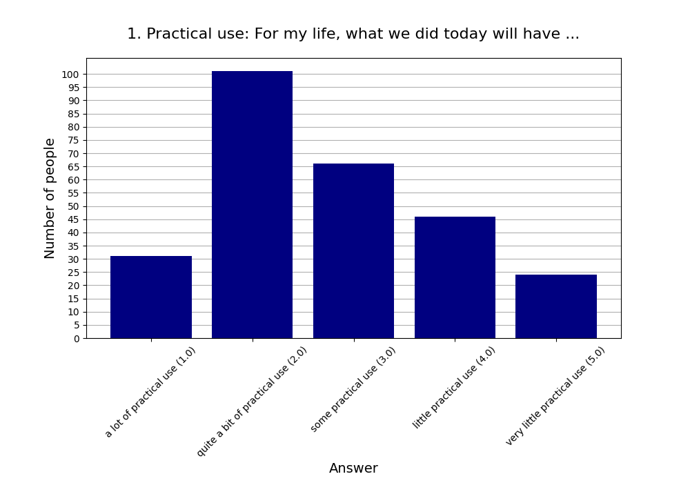
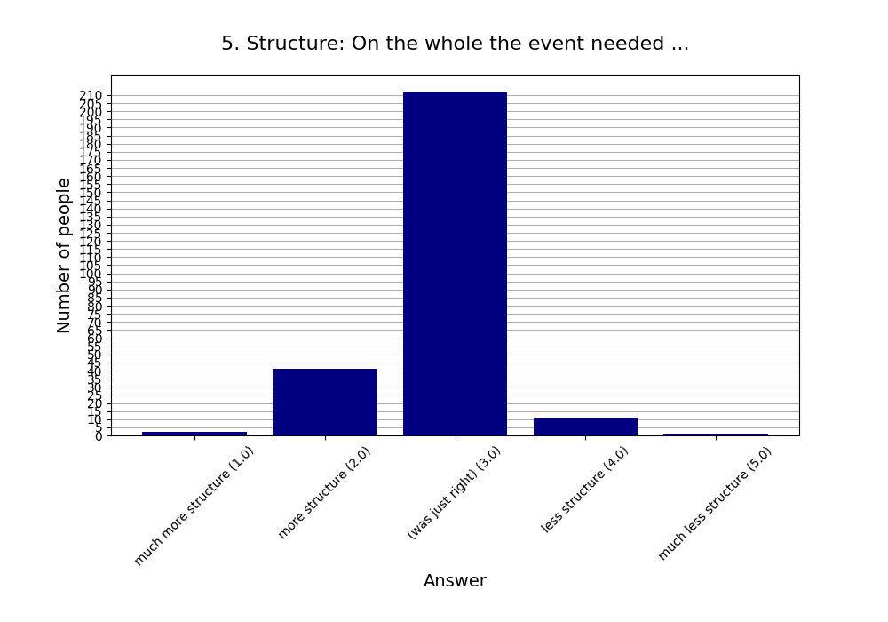

**Note that this page will be updated through 2025.**

This page contains a summary of all events. You can see the statistics
for the individual events here:

* [Probability of Doom]()
* [Rationality 101 - The Basics (Part 1)]()
* [Rationality 101 - The Basics (Part 2)]()
* [Cognitive Reading Strategies]()
* [Is Wikipedia Wrong? (Closed Meetup)]()
* [Zener Science]()
* [ACX Meetups Everywhere (Spring 2025)]()
* [Applied Rationality (Closed Meetup)]()

## Attendees

* 8 events.
* 17.00 people per event on average (σ=2.27).
* 1.88 newcomers per event (σ=1.64).
* Maximum number of attendees was 20 and minimum was 14 people.

**Recurring** is any person coming for the second, third etc. time whereas
**New** is anyone coming for the first time to a Rationality Freiburg event.

### Attendance

                            

                    

### Retention per event

Retention means the percentage of participants who attended one or more of the three following events.
* **Average retention:** 77.35% (67 / 88)

                            

                    

### People per events attended

How many people attended how many events.

                            

                    

### Referrals

                            

                    

### Newcomer retention

Retention means the percentage of newcomers who attended one or more of the three following events (after their first event), grouped by how they originally found RatFr.
* **Average newcomer retention:** 16.67% (2 / 12)

                            

                    

## Feedback

* **Responses:** 113 people (83.09% of attendees)

                            

                    

### 1. Practical use: For my life, what we did today will have ...

* **Responses:** 112 people (82.35% of attendees)
* **Answers:**
  * a lot of practical use (1): 10 people
  * quite a bit of practical use (2): 48 people
  * some practical use (3): 23 people
  * little practical use (4): 20 people
  * very little practical use (5): 11 people
* **Average answer:** 2.77 (σ=1.15)

### 2. The atmosphere / vibe was ...

* **Responses:** 113 people (83.09% of attendees)
* **Answers:**
  * fantastic (1): 49 people
  * good (2): 50 people
  * okay (3): 11 people
  * bad (4): 1 person
  * horrible (5): 2 people
* **Average answer:** 1.73 (σ=0.81)

### 3. The amount of content / exercises covered was ...

* **Responses:** 111 people (81.62% of attendees)
* **Answers:**
  * way too much (1): 1 person
  * too much (2): 22 people
  * just right (3): 76 people
  * too little (4): 12 people
  * way too little (5): 0 people
* **Average answer:** 2.89 (σ=0.58)

### 4. The difficulty level of the content / discussion was ...

* **Responses:** 113 people (83.09% of attendees)
* **Answers:**
  * much too easy (1): 3 people
  * too easy (2): 23 people
  * just right (3): 78 people
  * too difficult (4): 9 people
  * much too difficult (5): 0 people
* **Average answer:** 2.82 (σ=0.60)

### 5. Structure: On the whole the event needed ...

* **Responses:** 112 people (82.35% of attendees)
* **Answers:**
  * much more structure (1): 0 people
  * more structure (2): 12 people
  * (was just right) (3): 98 people
  * less structure (4): 2 people
  * much less structure (5): 0 people
* **Average answer:** 2.91 (σ=0.34)

### 6. The moderation should have been ...

* **Responses:** 113 people (83.09% of attendees)
* **Answers:**
  * much more relaxed (1): 1 person
  * more relaxed (2): 2 people
  * (was just right) (3): 96 people
  * more assertive (4): 13 people
  * much more assertive (5): 1 person
* **Average answer:** 3.10 (σ=0.44)

### 7. Host preparation: The content / exercises were ...

* **Responses:** 113 people (83.09% of attendees)
* **Answers:**
  * very well prepared (1): 58 people
  * well prepared (2): 38 people
  * okay prepared (3): 12 people
  * not well prepared (4): 5 people
  * not well prepared at all (5): 0 people
* **Average answer:** 1.68 (σ=0.84)

### 8. Changing your mind: The event made me ...

* **Responses:** 113 people (83.09% of attendees)
* **Answers:**
  * question many things (1): 2 people
  * question some things (2): 57 people
  * question few things (3): 24 people
  * question very few things (4): 23 people
  * not question anything (5): 7 people
* **Average answer:** 2.79 (σ=1.00)

### 9. Do you think you will come to one (or more) of the next three events?

* **Responses:** 112 people (82.35% of attendees)
* **Answers:**
  * probably no: 8 people
  * probably yes: 104 people

### 10. If you answered "probably no" in the previous question or are very uncertain, why is that?

* **Responses:** 15 people (11.03% of attendees)
* **Answers:**
  * Friday evening is a bad timeslot for me.: 5 people
  * I can't fit another activity into my life.: 3 people
  * I did not like (some of) the people here.: 0 people
  * I did not like today's venue.: 0 people
  * I live too far away.: 6 people
  * I'm not very interested in your usual topics.: 1 person
  * The level of English is too advanced for me.: 0 people

### 11. What did you like the most today?

* **Responses:** 70 people (51.47% of attendees)

**Note:** Anything contained in square brackets [] is an edit by the organizers.

> nice people

> It was a great idea to ask people to write down their "when to act" thresholds and estimates beforehand since then the numbers shown during the presentation were suddenly much more meaningful.

> listening to the various perceptions of others

> Actually changing some minds

> Discussion & seeing other's probabilities

> Interesting topic, good discussion 

> The lively discussion

> Die Gruppendiskussion am Ende

> people

> Pondering about a topic that I usually would not take time to investigate.

> In interactive part of the presentation and the small group

> I improved my knowledge on rationality and learned a few tools

> I'm not new to rationality, but it was still good to go over the basics again 

> New yorker article

> Great presentation! - loved the exercises

> People

> The discussion of concepts and the practical exercises

> Going through the Basics with a group.  
> Even though I knew most of the basics already, Having a group around me made the repetition fun.

> Ich war mal wieder da. Sehr netter Event

> small group discussion

> The specificity of the subject and the way it was "translated" to the common understanding. I was happy to be able to follow it, even if my background is not education/philosophy... 

> Backup ev calculation

> Good preparation. good questions. Made me think.

> Emotional relief about backups

> I always enjoy the small group discussion 

> Learning about the value of time

> Interesting topic, high relevance for daily life

> The small discussion about the stupidity post. Also the value of your time exercise.

> Being able to actually calculate the expected value, not sure if I still understood it correctly but now I will consciously try to calculate it every time.

> Super interesting content! I found myself doing it already when reading Text 2 and I'm definitely going to use in the future

> The concept and the topic

> Learning the basic techniques

> As always, I enjoyed the small group discussions 

> Practical tips

> Quizzing and guessing 

> Die Übungen allgemein 

> The discussions. The commitment to a particular answer.

> Learning fun facts

> Seeing everyone

> Really well prepared, good learnings, and a lot of fun!

> Hearing people’s perspectives regarding telepathy 

> The educational effect of learning about p hacking 

> The experimental setup and discussing p hacking

> Very fun

> I wanted to share feedback for the Wikipedia event. I liked all the selected articles, it was very interesting for me. Thanks to Omar and Ben for the preparation, I learned at least something from all the different topics and enjoyed that a lot.I would like to have that session again.

> Fun exercise - even not changing my mind, had a great time!

> Learning about P hacking

> Hot discussions

> Discussing various topics with people

> Well chosen articles, overall structure of the event

> Die Diskussion in der kleinen Gruppe 

> The topics were interesting and had good variety

> Opposing ideas and animated debating

> Various topics 

> Open discussion, respectful interactions

> Conflict theory

> The discussion in groups

> The hot seat activity

> The hot seat exercise made me feel more connected and have better understanding of the other people there.

> Anti Self Deception

> Die Hot Seat Übung 

> All activities were great. And also felt they were a good combination of whole group, individual, small group activities.

> The hot seat exercise 

> Topics and hot seat introduction 

> OODA loops and self deception info and hot seat

> hotseat und präsentationen

> hot seat - really great idea  
> the post about self-deception

> Focus on practical application

> Self deception

> Hot Seat
### 12. What did you like the least?

* **Responses:** 50 people (36.76% of attendees)

**Note:** Anything contained in square brackets [] is an edit by the organizers.

> a little more time for group discussion would have been nice (also at least one swapping of people in the smaller group)

> Micro-optimization: Instead of suggesting updating the estimates for every slide it might have been better to have 4 checkpoints during the presentation where participants were explicitly asked "now revise your estimates, if you want to, you have 2 minutes". It would also have given more space on the page to write.

> I would've liked a bit more time to discuss in small groups

> Forgot some things

> Snacks

> The Room was too cold!

> The lack of deep explanation /arguments for each prediction

> location is far lol

> I was expecting fact based probability calculations. Just trying to come up with numbers without any facts didn't make much sense 

> How irrational I am 🤣

> too many snacks 

> Looking at my phone in a room full of people 

> Ideas about the article were not discussed together

> nothing comes to mind 

> Long text 

> Repeat some content from part 1

> Not enough time for discussion

> The intro was a bit boring for me, but still good to have this for newcomers and also as a repetition.

> Nothing, it was a great session!

> Large texts

> Would have wanted more deliberation on how to do the things mentioned

> Too much reading content for me for a friday evening. Reading stategies were not that new, learnings were moderate. 

> Time moderation, during questions.   
> And moderation attention on female participants that are usually left with less attention (do we have a gender issue at the group?)

> was boring

> The title of Text 2 was a bit misleading. I didn't expect I would read only about authoritarian leader

> Teilweise waren die Diskussionen etwas ausschweifend

> The length of the text

> Detecting subtle mistakes eg. Numbers

> Nothing

> I was hoping for more information about Zener in the end

> Intro round took too long.

> Entering the data in the form

> too much statistics ;)

> Taste of Water

> Our discussion group was too big, I did not feel able to split it then

> Die Diskussion am Ende über AI war etwas off-topic und unstrukturiert

> Sometimes the discussion became unstructured but maybe that's a feature 

> More focus on AI

> non-inclusive discussion

> The article about IQ - I thought it was too superficial

> Hot Seat (didn't think it had much use. Maybe better as a prepared Event so everyone can prepare good questions. Or with pre-printented questions and the option to go away from them any time)

> Die Einleitung zur Hostile Telepathy war etwas zu lang, aber trotzdem nützlich 

> The explanation for the last two activities took maybe longer than it could have.

> Explanation for hostile telepathy was too long.

> Self deception exercises

> median fragerunde

> The ice breaker exercises did not seem relevant for the later methods (since those were individual not group exercises)

> Ooda-too simple

> Hostile Telepath

> The topics discussed did not have much impact for me. I don't feel closer to enlightenment. (sorry! Not meant as an offense! They were well presented.)
