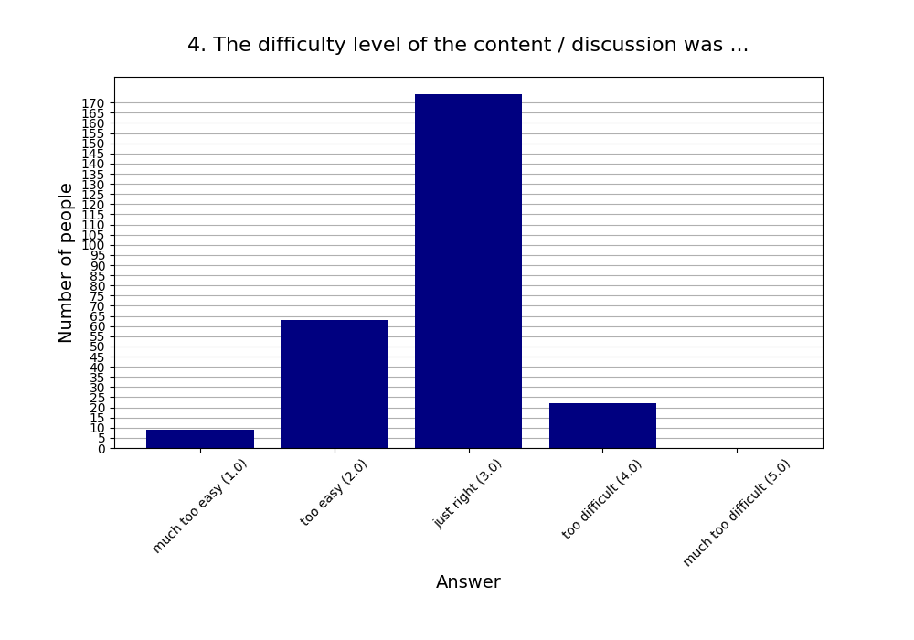

**Note that this page will be updated through 2025.**

This page contains a summary of all events. You can see the statistics
for the individual events here:

* [Probability of Doom]()

## Attendees

* 1 events.
* 19.00 people per event on average (σ=nan).
* 3.00 newcomers per event (σ=nan).
* Maximum number of attendees was 19 and minimum was 19 people.

**Recurring** is any person coming for the second, third etc. time whereas
**New** is anyone coming for the first time to a Rationality Freiburg event.

### Attendance

                            

                    

### Referrals

                            

                    

## Feedback

* **Responses:** 15 people (78.95% of attendees)

                            

                    

### 1. Practical use: For my life, what we did today will have ...

* **Responses:** 15 people (78.95% of attendees)
* **Answers:**
  * a lot of practical use (1): 1 person
  * quite a bit of practical use (2): 6 people
  * some practical use (3): 3 people
  * little practical use (4): 1 person
  * very little practical use (5): 4 people
* **Average answer:** 3.07 (σ=1.39)

### 2. The atmosphere / vibe was ...

* **Responses:** 15 people (78.95% of attendees)
* **Answers:**
  * fantastic (1): 8 people
  * good (2): 6 people
  * okay (3): 0 people
  * bad (4): 0 people
  * horrible (5): 1 person
* **Average answer:** 1.67 (σ=1.05)

### 3. The amount of content / exercises covered was ...

* **Responses:** 15 people (78.95% of attendees)
* **Answers:**
  * way too much (1): 0 people
  * too much (2): 0 people
  * just right (3): 12 people
  * too little (4): 3 people
  * way too little (5): 0 people
* **Average answer:** 3.20 (σ=0.41)

### 4. The difficulty level of the content / discussion was ...

* **Responses:** 15 people (78.95% of attendees)
* **Answers:**
  * much too easy (1): 0 people
  * too easy (2): 5 people
  * just right (3): 10 people
  * too difficult (4): 0 people
  * much too difficult (5): 0 people
* **Average answer:** 2.67 (σ=0.49)

### 5. Structure: On the whole the event needed ...

* **Responses:** 14 people (73.68% of attendees)
* **Answers:**
  * much more structure (1): 0 people
  * more structure (2): 0 people
  * (was just right) (3): 14 people
  * less structure (4): 0 people
  * much less structure (5): 0 people
* **Average answer:** 3.00 (σ=0.00)

### 6. The moderation should have been ...

* **Responses:** 15 people (78.95% of attendees)
* **Answers:**
  * much more relaxed (1): 0 people
  * more relaxed (2): 0 people
  * (was just right) (3): 12 people
  * more assertive (4): 3 people
  * much more assertive (5): 0 people
* **Average answer:** 3.20 (σ=0.41)

### 7. Host preparation: The content / exercises were ...

* **Responses:** 15 people (78.95% of attendees)
* **Answers:**
  * very well prepared (1): 6 people
  * well prepared (2): 8 people
  * okay prepared (3): 1 person
  * not well prepared (4): 0 people
  * not well prepared at all (5): 0 people
* **Average answer:** 1.67 (σ=0.62)

### 8. Changing your mind: The event made me ...

* **Responses:** 15 people (78.95% of attendees)
* **Answers:**
  * question many things (1): 0 people
  * question some things (2): 12 people
  * question few things (3): 3 people
  * question very few things (4): 0 people
  * not question anything (5): 0 people
* **Average answer:** 2.20 (σ=0.41)

### 9. Do you think you will come to one (or more) of the next three events?

* **Responses:** 15 people (78.95% of attendees)
* **Answers:**
  * probably no: 2 people
  * probably yes: 13 people

### 10. If you answered "probably no" in the previous question or are very uncertain, why is that?

* **Responses:** 2 people (10.53% of attendees)
* **Answers:**
  * Friday evening is a bad timeslot for me.: 2 people
  * I can't fit another activity into my life.: 0 people
  * I did not like (some of) the people here.: 0 people
  * I did not like today's venue.: 0 people
  * I live too far away.: 0 people
  * I'm not very interested in your usual topics.: 0 people
  * The level of English is too advanced for me.: 0 people

### 11. What did you like the most today?

* **Responses:** 10 people (52.63% of attendees)

**Note:** Anything contained in square brackets [] is an edit by the organizers.

> nice people

> It was a great idea to ask people to write down their "when to act" thresholds and estimates beforehand since then the numbers shown during the presentation were suddenly much more meaningful.

> listening to the various perceptions of others

> Actually changing some minds

> Discussion & seeing other's probabilities

> Interesting topic, good discussion 

> The lively discussion

> Die Gruppendiskussion am Ende

> people

> Pondering about a topic that I usually would not take time to investigate.
### 12. What did you like the least?

* **Responses:** 9 people (47.37% of attendees)

**Note:** Anything contained in square brackets [] is an edit by the organizers.

> a little more time for group discussion would have been nice (also at least one swapping of people in the smaller group)

> Micro-optimization: Instead of suggesting updating the estimates for every slide it might have been better to have 4 checkpoints during the presentation where participants were explicitly asked "now revise your estimates, if you want to, you have 2 minutes". It would also have given more space on the page to write.

> I would've liked a bit more time to discuss in small groups

> Forgot some things

> Snacks

> The Room was too cold!

> The lack of deep explanation /arguments for each prediction

> location is far lol

> I was expecting fact based probability calculations. Just trying to come up with numbers without any facts didn't make much sense 
